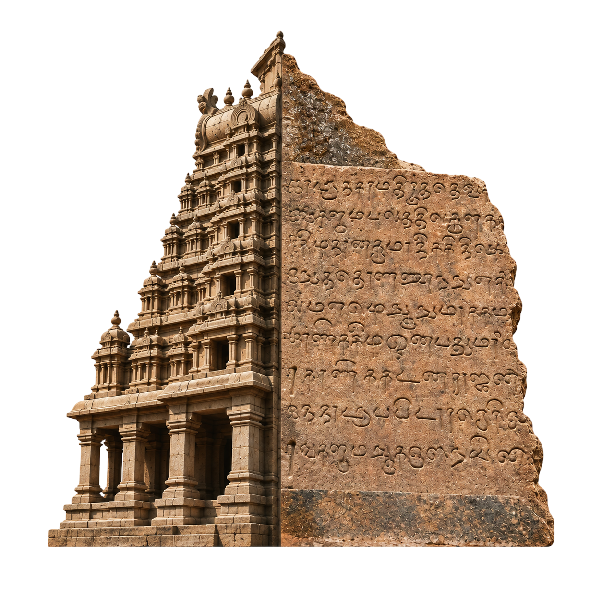

<div align="center">
  
  <h1>Silaimozhi - Digital Archive of Tamil Temple Inscriptions</h1>
</div>

A modern, production-quality web application for a digital Tamil heritage project focused on **Tamil temple inscriptions (கல்வெட்டு / Kalvettu)**. It connects the physical temple → the exact inscription location → the original image → the transcription → the translation → the historical meaning → the authoritative source.

> **Core principle: nothing is invented.** Every inscription retains its publication reference (SII volume/number, ARE number, or Epigraphia Indica). Where a fact, translation, image, or physical location cannot be verified from a primary/authoritative source, it is marked as *not recorded* rather than guessed.

---

## Tech Stack

| Layer      | Technology |
|------------|------------|
| Frontend   | React 18 + TypeScript + Vite + Tailwind CSS |
| Backend    | Python 3 + FastAPI (REST API) |
| Database   | SQLite (development) / PostgreSQL (production) |
| Maps       | Leaflet + OpenStreetMap (react-leaflet) |

## Running the project (Development)

### 1. Start the Backend (FastAPI, port 8000)

```bash
cd python_backend
# Activate virtual environment if you have one
# pip install -r requirements.txt
uvicorn main:app --reload --port 8000
```

### 2. Start the Frontend (Vite, port 5173)

```bash
cd frontend
npm install
npm run dev
```

- Open http://localhost:5173 - the Vite dev server proxies `/api` to the backend on :8000.

---

## Screens & Features

1. **Home** - Cinematic hero section, featured temples, explore by dynasty/district, featured inscriptions.
2. **Temple Gallery** - Real photographs, search & filters (district/dynasty), verified cards.
3. **Temple Details** - Overview, history, architecture, inscriptions, gallery, map, references.
4. **Inscription Explorer** - Search + filter by temple / dynasty / ruler / district; thumbnails.
5. **Inscription Details** - Original image, identification, transcription, translation, simple explanation, historical significance, and the cited source.
6. **Interactive Temple Map** - Real temple coordinates (Leaflet/OSM); in-temple schematic of *verified* inscription locations.
7. **Explore by Dynasty / District** - Tamil Nadu districts + dynasty explorer.
8. **Timeline** - Temples and rulers in chronological order, appearing as a continuous journey.
9. **Sources / About** - Project purpose, data policy, and authorities used.

---

## Data Provenance

All textual data is securely served by the backend API. Image URLs were fetched from the **Wikimedia Commons API** and validated before inclusion, with author + licence captured for attribution. Primary inscription sources include:

- **South Indian Inscriptions (SII)** - e.g. Vol. II (Rajarajesvaram temple, Thanjavur, ed. V. Venkayya); Vol. I (Pallava, Kanchipuram); Vol. XII (Chidambaram).
- **Annual Report on (South) Indian Epigraphy (ARE)**
- **Epigraphia Indica**, **Archaeological Survey of India**, **UNESCO**, **Tamil Nadu Dept. of Archaeology**.

The original-script Tamil/Grantha text is cited to its publication to avoid propagating OCR errors; English summaries/translations are quoted from the cited editors.